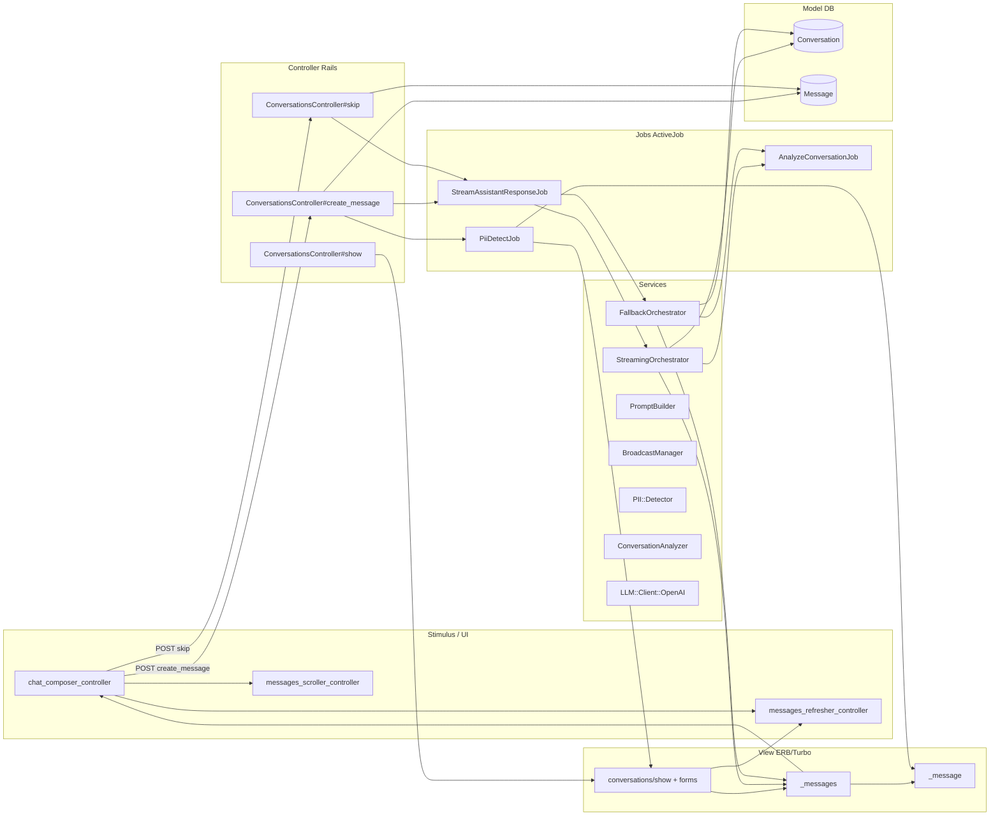
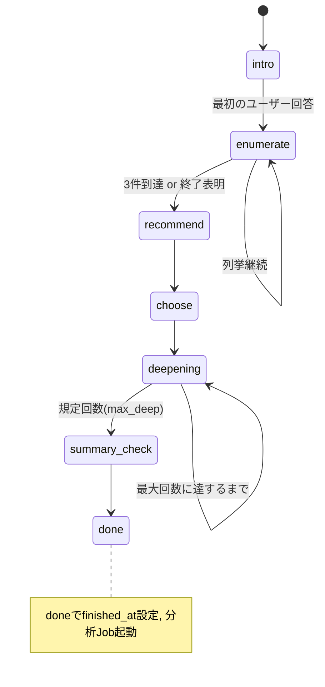
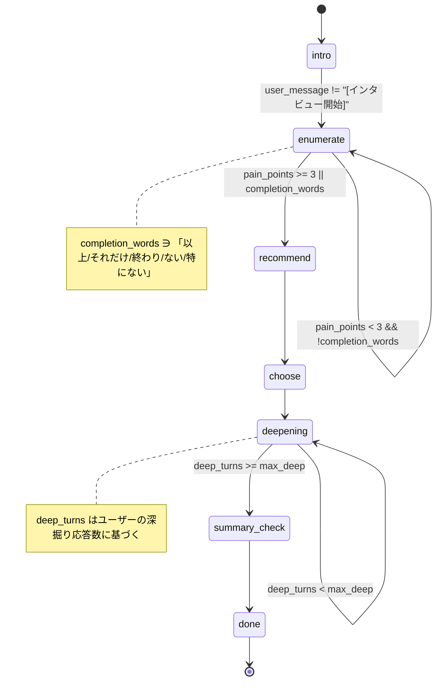
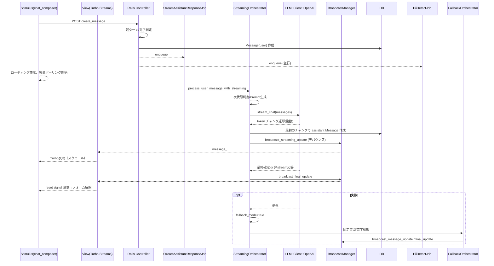
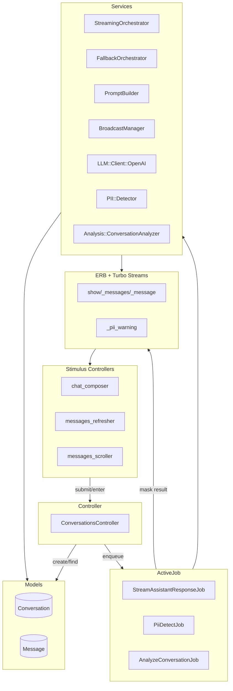

# チャットワークフロー（Stimulus / View / Controller / Service / Model）

本書は、会話（チャット）機能のリファクタリングに向けて、現行の責務分割とフローを俯瞰できるようにまとめたものです。UI と非同期処理、ストリーミング、PII マスク、会話完了・分析までを一気通貫で示します。

## 全体フローチャート

## 各レイヤの主な責務と参照ファイル

- Stimulus:
  - chat_composer_controller.js: 送信・Enter送信、ローディング、フォームリセット信号検知、失敗時の簡易ポーリング
  - messages_refresher_controller.js: Turbo Stream取りこぼし時の部分更新
  - messages_scroller_controller.js: 新規メッセージで自動スクロール
- View:
  - conversations/show.html.erb, _messages.html.erb, _message.html.erb, _pii_warning.html.erb
- Controller:
  - ConversationsController#show/#create_message/#skip
- Service/Jobs:
  - Interview::StreamingOrchestrator / FallbackOrchestrator / PromptBuilder / BroadcastManager
  - LLM::Client::OpenAI
  - PiiDetectJob, PII::Detector
  - AnalyzeConversationJob, Analysis::ConversationAnalyzer
- Model:
  - Conversation, Message

## 状態遷移（会話の粗い流れ）

参考: 失敗時は state=fallback に移行し、固定3問で完了に導きます。

## 重要イベントとブロードキャスト

- streaming 中: 最初のチャンクで assistant message を作成し append、その後は内容を更新して replace。BroadcastManager が 150ms デバウンスで置換を送出。
- 完了/確定時: messages 全体を replace してUI整合性を確保し、フォームリセット信号を埋め込み（Hidden span + CustomEvent）。
- PII 検出時: 対象 message の replace、および PII 警告バナーを append。

---

補足のアルゴリズム詳細は docs/chat_algorithms.md を参照してください。

## 詳細: 状態マシン（条件付き）

## 詳細: ストリーミング配信（シーケンス）

## 責務境界（Boundary 図）

