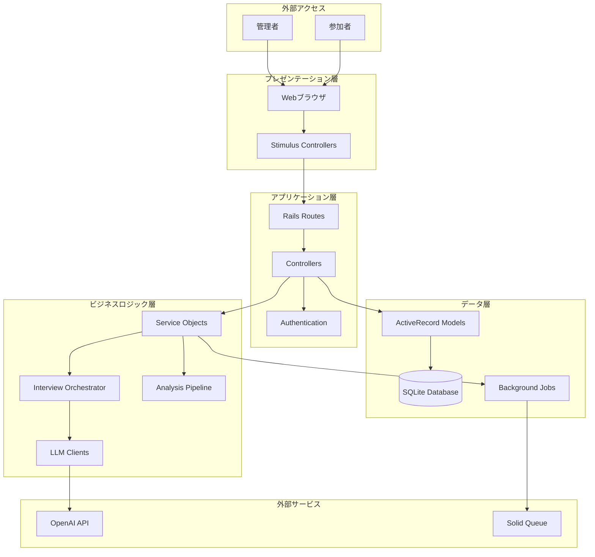
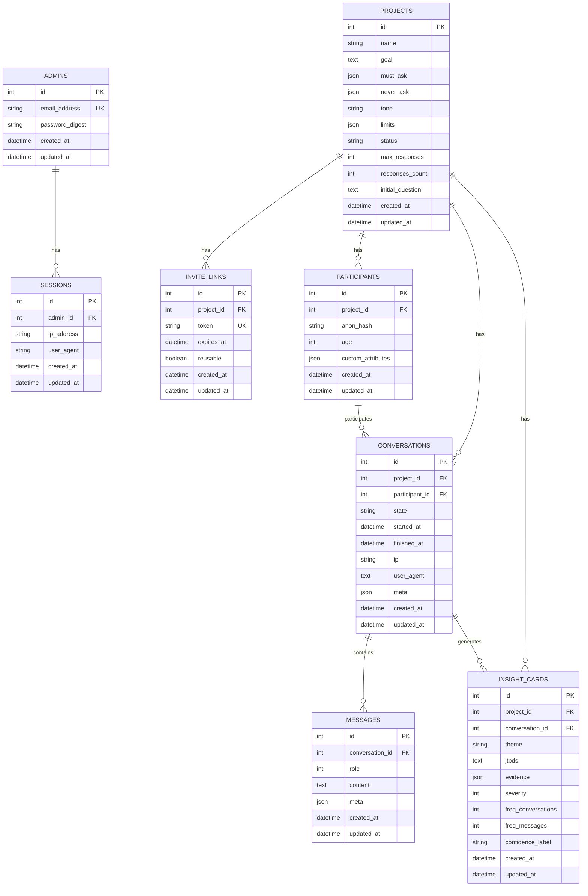

# Survey Shark システムアーキテクチャ

## 概要

Survey Sharkは、AI駆動のインタビューチャットシステムです。管理者がプロジェクトを作成し、参加者が招待リンクを通じてAIとの対話形式でインタビューに参加することができます。システムは会話を分析し、インサイトを抽出する機能も提供します。

## アーキテクチャの概要



## 技術スタック

### フレームワーク・ライブラリ
- **Ruby on Rails 8.0.2**: メインフレームワーク
- **SQLite**: データベース
- **Hotwired (Turbo + Stimulus)**: フロントエンドフレームワーク
- **Tailwind CSS**: スタイリング
- **Solid Queue**: バックグラウンドジョブ処理
- **Ruby OpenAI**: OpenAI API クライアント

### 開発・運用
- **Kamal**: デプロイメント
- **Docker**: コンテナ化
- **Puma**: WebServer
- **Propshaft**: アセットパイプライン

## データベース設計

### エンティティ関係図



## アプリケーション層の構造

### 1. ルーティング設計

```ruby
# 管理画面
resources :projects do
  member { get/post :generate_invite_link }
  resources :insights, only: [:index, :show]
end
resource :session
resources :admins
resources :passwords

# 公開インタビュー
get "i/:token", to: "invites#show"
post "i/:token/start", to: "invites#start"
get "i/:token/attributes", to: "invites#attributes"
post "i/:token/create_participant", to: "invites#create_participant"

# 会話
resources :conversations, only: [:show] do
  member { post :create_message, :skip }
end

# 完了ページ
resources :projects do
  resource :thank_you do
    post :restart
  end
end
```

### 2. コントローラー構成

#### 管理系コントローラー
- **ProjectsController**: プロジェクト管理
- **InsightsController**: 分析結果表示
- **SessionsController**: 認証
- **AdminsController**: 管理者設定

#### 公開系コントローラー
- **InvitesController**: 招待リンク処理
- **ConversationsController**: チャット画面
- **ThankYousController**: 完了画面

#### 共通機能
- **Authentication Concern**: セッション管理
- **ApplicationController**: 基底クラス

### 3. モデル設計

#### 認証・ユーザー管理
```ruby
class Admin < ApplicationRecord
  has_secure_password
  has_many :sessions
end

class Session < ApplicationRecord
  belongs_to :admin
end

class Current < ActiveSupport::CurrentAttributes
  attribute :session
  delegate :user, to: :session
end
```

#### プロジェクト管理
```ruby
class Project < ApplicationRecord
  has_many :invite_links
  has_many :participants
  has_many :conversations
  has_many :insight_cards

  # 状態: draft, active, closed
  # 制限: max_responses, max_turns, max_deep
end

class InviteLink < ApplicationRecord
  belongs_to :project
  # トークンベースのアクセス制御
end
```

#### インタビュー実行
```ruby
class Participant < ApplicationRecord
  belongs_to :project
  has_many :conversations
  # 匿名化されたユーザー情報
end

class Conversation < ApplicationRecord
  belongs_to :project
  belongs_to :participant
  has_many :messages

  # 状態: intro, enumerate, recommend, choose, deepening, summary_check, done, fallback
end

class Message < ApplicationRecord
  belongs_to :conversation
  # 役割: user(0), assistant(1)
end
```

#### 分析・インサイト
```ruby
class InsightCard < ApplicationRecord
  belongs_to :project
  belongs_to :conversation, optional: true

  # 分析結果: theme, jtbds, evidence, severity, frequency
end
```

## サービス層アーキテクチャ

### 1. インタビュー管理

```ruby
module Interview
  class Orchestrator
    # メインのインタビューオーケストレーター
    # 状態管理、応答生成、分析キューイング
  end

  class FallbackOrchestrator
    # LLMエラー時のフォールバック
    # 事前定義質問による対話継続
  end

  class StreamingOrchestrator
    # リアルタイム応答配信
    # WebSocket/ActionCableとの連携
  end

  class PromptBuilder
    # LLMプロンプト構築
    # プロジェクト設定に基づく動的生成
  end

  class BroadcastManager
    # リアルタイム更新配信
    # Turbo Streamとの連携
  end
end
```

### 2. LLM統合

```ruby
module LLM
  module Client
    class Base
      # 抽象基底クラス
    end

    class OpenAI < Base
      # OpenAI API クライアント
      # レスポンス処理、エラーハンドリング
    end

    class Fake < Base
      # テスト用フェイククライアント
    end
  end
end
```

### 3. 分析パイプライン

```ruby
module Analysis
  class ConversationAnalyzer
    # 会話内容の分析
    # テーマ抽出、重要度評価
  end

  class Insight
    # インサイト表現オブジェクト
    # theme, jtbd, summary, severity等
  end

  class KeywordExtractor
    # キーワード抽出
  end

  class TextProcessor
    # テキスト前処理
  end
end
```

### 4. その他のサービス

```ruby
module PII
  class Detector
    # 個人情報検出
  end

  class DetectionResult
    # 検出結果表現
  end
end
```

## バックグラウンドジョブ

### ジョブ構成
```ruby
class AnalyzeConversationJob < ApplicationJob
  # 会話完了時の分析処理
  # ConversationAnalyzerとの連携
end

class StreamAssistantResponseJob < ApplicationJob
  # リアルタイム応答配信
  # StreamingOrchestratorとの連携
end

class OrchestrationJob < ApplicationJob
  # インタビュー進行管理
end

class PIIDetectJob < ApplicationJob
  # 個人情報検出・マスキング
end
```

### キューイングシステム
- **Solid Queue**: Rails 8標準のジョブキュー
- **設定**: config/queue.yml
- **モニタリング**: Rails内蔵管理画面

## フロントエンド アーキテクチャ

### 1. Stimulusコントローラー

```javascript
// チャット機能
ChatComposerController
- フォーム送信
- 文字数カウント
- ローディング状態
- イベント管理

SkipFormController
- スキップ機能
- 状態同期

FormResetController
- フォームリセット
- イベント配信

// UI機能
CopyButtonController
- テキストコピー
- フィードバック表示

MobileMenuController
- モバイルナビゲーション
```

### 2. リアルタイム機能

```ruby
# Turbo Streams
- メッセージ追加
- 状態更新
- フォームリセット

# ActionCable（将来拡張）
- リアルタイムチャット
- 進行状況配信
```

### 3. アセット管理

```ruby
# Import Maps
- モジュール管理
- 依存関係解決

# Propshaft
- アセットパイプライン
- ファイル処理

# Tailwind CSS
- ユーティリティファーストCSS
- レスポンシブデザイン
```

## セキュリティ設計

### 1. 認証・認可

```ruby
# セッションベース認証
- HttpOnly Cookie
- CSRF Protection
- Rate Limiting (SessionsController)

# アクセス制御
- Admin: フル機能アクセス
- Participant: 招待トークンベース制限アクセス
```

### 2. データ保護

```ruby
# 匿名化
- anon_hash: タイムスタンプ + ランダム値
- IP/User-Agent記録: セキュリティ監査用

# 個人情報保護
- PII検出機能
- データ最小化原則
```

### 3. 外部API

```ruby
# OpenAI API
- API Key管理
- レート制限対応
- エラーハンドリング
- フォールバックメカニズム
```

## 運用・監視

### 1. ログ管理

```ruby
# アプリケーションログ
- Rails.logger
- 構造化ログ出力
- レベル別管理

# アクセスログ
- Puma access log
- セキュリティ監査
```

### 2. エラーハンドリング

```ruby
# LLMエラー
- OpenAI API障害対応
- Fallback Orchestratorへの自動切り替え

# 一般的なエラー
- ActiveRecord::RecordNotFound
- Validation errors
- Network timeouts
```

### 3. パフォーマンス

```ruby
# データベース
- 適切なインデックス
- N+1問題対策

# バックグラウンド処理
- 非同期分析処理
- リアルタイム応答配信
```

## 設定管理

### 1. 環境別設定

```ruby
# Development
- SQLite database
- OpenAI Fake client
- 詳細ログ出力

# Production
- SolidQueue for jobs
- OpenAI real client
- 最適化設定

# Test
- In-memory database
- Fake LLM client
- テスト専用設定
```

### 2. 設定項目

```ruby
# LLM設定
- Model selection (gpt-4)
- Temperature (0.2)
- Max tokens (500)

# インタビュー設定
- Default max_turns (12)
- Default max_deep (2)
- Response length limit (400)

# セキュリティ設定
- Session timeout
- Rate limits
- CORS settings
```

## API設計

### 1. RESTful API

```ruby
# プロジェクト管理
GET    /projects          # 一覧
POST   /projects          # 作成
GET    /projects/:id      # 詳細
PATCH  /projects/:id      # 更新
DELETE /projects/:id      # 削除

# インタビュー参加
GET    /i/:token          # 同意画面
POST   /i/:token/start    # 開始
GET    /i/:token/attributes # 属性入力
POST   /i/:token/create_participant # 参加者作成

# 会話
GET    /conversations/:id # チャット画面
POST   /conversations/:id/create_message # メッセージ送信
POST   /conversations/:id/skip # スキップ
```

### 2. WebSocket API（将来拡張）

```ruby
# リアルタイム機能
- メッセージ配信
- 状態同期
- 進行状況更新
```

## テスト戦略

### 1. テスト構成

```ruby
# Unit Tests
- Model validations
- Service objects
- LLM clients

# Integration Tests
- Controller actions
- Authentication flow
- API endpoints

# System Tests
- End-to-end user flows
- JavaScript interactions
- Mobile responsiveness
```

### 2. テストデータ

```ruby
# Fixtures
- Admin accounts
- Sample projects
- Conversation scenarios

# Factories（将来導入検討）
- 動的テストデータ生成
```

## 拡張計画

### 1. スケーラビリティ

```ruby
# データベース
- PostgreSQL移行
- レプリケーション
- パーティショニング

# キュー処理
- Redis + Sidekiq
- 水平スケーリング
```

### 2. 機能拡張

```ruby
# 多言語対応
- I18n設定
- 多言語LLMモデル

# 高度な分析
- 感情分析
- トレンド分析
- データ可視化

# 外部連携
- Slack/Teams通知
- データエクスポート
- Webhook対応
```

## まとめ

Survey Sharkは、モノリシックなRails 8アプリケーションとして設計されており、以下の特徴を持ちます：

- **シンプルな構成**: 単一アプリケーション、SQLiteデータベース
- **モダンなフロントエンド**: Hotwired + Stimulus
- **AI統合**: OpenAI APIとのシームレスな連携
- **非同期処理**: SolidQueueによるバックグラウンド処理
- **拡張性**: 将来的なスケーリングを考慮した設計

この設計により、迅速な開発と保守性の両立を実現し、AI駆動のインタビューシステムとして効果的に機能します。
